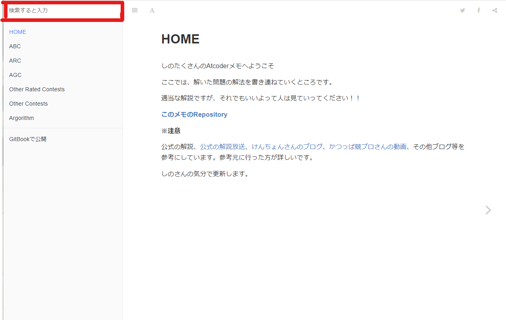
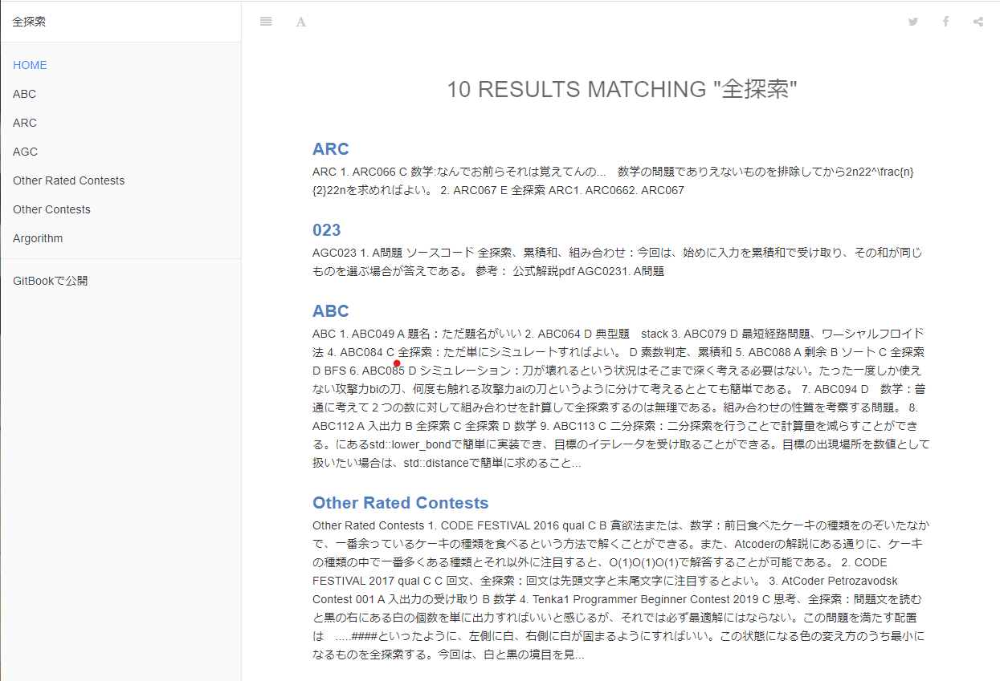

# HOME

tessoのAtcoderメモへようこそ

ここでは、解いた問題の解法を書き連ねていくところです。

適当な解説ですが、それでもいいよって人は見ていってください！！

[**このメモのRepository**](https://github.com/ShinoTakusan/Atcoder)

**※注意**

公式の解説、[公式の解説放送](https://www.youtube.com/channel/UCtG3StnbhxHxXfE6Q4cPZwQ)、[けんちょんさんのブログ](https://drken1215.hatenablog.com/)、[かつっぱ競プロさんの動画](https://www.youtube.com/channel/UCqqeYOh1gk_TJ16sxazWhUg)、その他ブログ等を参考にしています。参考元に行った方が詳しいです。

## tessoのAtcoderメモの使い方

こんなメモの活用法を書いときます。このメモは解答ととに、その問題がどんなアルゴリズムで解けるのかをしのたくさんの気分次第で乗せています。

このタグを利用するとこんなことができます。

例えば、**全探索の問題が解きたいな～**と思ったら、下の図の赤色のところにbit全探索と打ち込みます。

*そこに全探索を打ち込む*

するとこんな感じにいっぱい出てきます。そこのRESULTにある問題をクリックして解説を読んだり、問題に挑戦したりできます。(すごい！！！)

覚えたてのアルゴリズムなんかは、類題をたくさん解くと早く定着しますし、自信がつきます。そんな類題探しにこのメモは役立てることができるのです！！

※基本的にタグは気分でつけてます。

タグ一覧を載せておきます。

- 数学　:　数学的考察、知識が強く必要になる問題
- 思考　:　考察が強く必要になる問題
- 全探索　:　全探索のアルゴリズムを使うもの
- bit全探索　:　bit全探索のアルゴリズムを使うもの
- ダイクストラ法　:　ダイクストラ法を使うもの
- ワーシャルフロイド法　:　ワーシャルフロイド法を使うもの
- 素数判定　:　素数判定のアルゴリズムを使うもの
- BFS　:　BFSを利用するもの
- ソート　:　ソートを利用するもの
- 累積和　:　累積和を利用するもの
- 入出力の受け取り　:　簡単な問題
- 特殊　:　どちらかというと特殊な問題で実装の応用性がなさそうなもの
- 最短経路問題　:　最短経路問題を題材にしたもの
- ナップザック問題　:　ナップザック問題を題材にしたもの

逐次更新予定

気分でタグ付けしているので正直微妙だし、一貫性がないものもある。気が向いたら直す。
