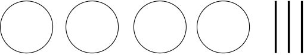
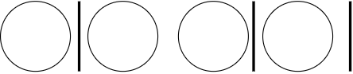
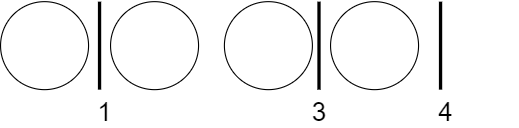

# ABC165

## A問題

[ソースコード](https://atcoder.jp/contests/abc165/submissions/12580654)

**入出力の受け取り**：B以下A以上にkの倍数が見つかるか見つからないかなので、AからBの間にkの倍数があるか調べればいい。また、解説pdfにある通り、B以下の最大のkの倍数を求め、それがA以上であるかと判断すれば解答できる。(1)

参考：

(1) [解説pdf](https://img.atcoder.jp/abc165/editorial.pdf)

## B問題

[ソースコード](https://atcoder.jp/contests/abc165/submissions/12601706)

**全探索**：この問題は入力を見ると一見間に合わなそうだが、sampleを見ると$$10^{18}$$で答えが$$3760$$であることより、十分間に合うことが分かる。単純に1%を足していけば答えとなる。

## C問題

[ソースコード next_permutationでの実装](https://atcoder.jp/contests/abc165/submissions/12655192)

[ソースコード DFSでの実装](https://atcoder.jp/contests/abc165/submissions/12670890)

**順列、DFS**：この問題は、基本的な考え方は一緒だが実装によって2通りある。

### 考え方
この問題の共通している考え方について解説する。

この問題は、いかに効率よくすべての数列$$A$$を列挙するかが大切である。これからその方法を考える。まずはm = 4 , n = 3として考えてみよう。図のようにmをボール、nを棒として考えて見る。

次に4個のボールと、3個の棒を適当に並び変えてみる。

するとこんな感じになる。次に、棒より左にあるボールの数を数えてみる。

すると、数列$$A$$の中の1つを表現していることが分かるだろうか？つまり、何が言いたいかというと、これらのボールと棒の並び方は数列$$A$$の中の1パターンを表現している。これらのボールと棒の並び方は、数列$$A$$のどれかと1対1対応しており、このボールと棒の並び方を考えればよくなる。その並び方は、$${}_{m+n} C_n$$となる。つまり、m+nの場所にn本の棒の置き方であり、計算量は$$O({}_{m+n} C_n)$$で入力より、最低でも$${}_{20} C_{10}$$(184756)なので間に合いそうである。※数列$$A$$を列挙するための計算量、実装の仕方で最悪計算量は少し変わる。(後述)

数列$$A$$をうまく列挙出来たら、あとは各条件に合うかどうかを調べるだけなので、数列の生成に$$O(N)$$、条件について調べるのが$$O(Q)$$、最終的に$$O((N+Q) {}_{m+n} C _n)$$となる。

### next_permutaion での実装

数列$$A$$を作成するために、next_permutaionを利用して実装する。※next_permutaion とは配列の中身を元に辞書順の次の順列を生成する関数 [next_permutaionについて](https://cpprefjp.github.io/reference/algorithm/next_permutation.html)
ボールと棒はそれぞれ0と1で表現することが可能で、1が来るまでの0の個数を利用すれば上の考え方と同じそうに数列$$A$$を生成することができる。しかし、この実装では、$$A_i$$が0のときも探索してしまうので、注意が必要。最悪計算量は$${}_{20} C _{10}$$となる。（参考１）

### DFS での実装

数列$$A$$を作成するために、DFS（再帰関数）を利用して実装する。始めに要素0の配列を準備し、その末尾に1を追加し、その末尾をインクリメントしていくことで数列$$A$$を生成していく。とりあえず、ソースコードを見たほうが分かると思う。それでもわからなければDFSするごとに配列の大きさを出力したり、実際に紙に書いてみると分かると思う。この実装では$$A_i$$が0のときを考慮しないので最悪計算量は$${}_{19} C _{10}$$となる。始めに入れた1は、インクリメントされないので注意。（参考２）

参考：

(1) [[競プロ実況] ABC165 AからD問題](https://www.youtube.com/watch?v=k_IqH4WjmxU&t=771s)

(2) [公式解説放送](https://www.youtube.com/watch?v=C5_NnCp1CRI&feature=youtu.be)

## D問題

[ソースコード](https://atcoder.jp/contests/abc165/submissions/12651019)

**数学**：この問題は数学的考察を行うと簡単に解くことができる。まずは、小数部分と整数部分で分けてみる。今回は、次のように考察していくとうまくいく。

---

N := $$floor(\frac{x}{B})$$の整数部分、M := $$floor(\frac{x}{B})$$の小数部分とする。

$$\frac{x}{B} = N + M$$が成り立つ。

これより、$$A\frac{x}{B} = AN + AM$$ であり、$$floor(A\frac{x}{B}) = floor(AN + AM)$$である。

AとNは整数なので $$floor(AN + AM) = AN + floor(AM)$$となる。

以上より、$$floor(\frac{Ax}{B}) - A \times floor(\frac{x}{B})\Longleftrightarrow AN + floor(AM) - AN \Longleftrightarrow floor(AM)$$

---

以上の考察より、この問題はMの最大化を考えればよくその最大のMは $$x = B-1$$のときである。しかし問題の制約より、n以下であることが必要である。上の考察でも分かる通り、$$floor(\frac{Ax}{B}) - A \times floor(\frac{x}{B})$$ は広義単調増加関数なので、もしも、nがB-1以下であればnのときが最大となる。

以上をまとめると $$x = min(n,B-1)$$のときが答えである。(1)

このように、床関数(floor()または、$$\lfloor$$　$$\rfloor$$)やガウス記号([　])のときは、<u>不等式を考えるか、その中身の整数部と小数部に分けて</u>考察するとよい。

参考：

(1) [[競プロ実況] ABC165 AからD問題](https://www.youtube.com/watch?v=k_IqH4WjmxU&t=771s)
