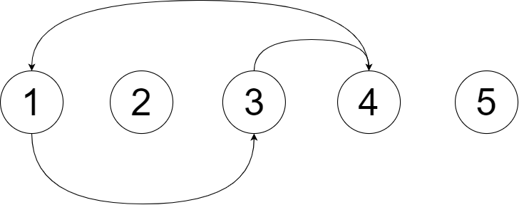

# ABC167

## A問題

[ソースコード](https://atcoder.jp/contests/abc167/submissions/13021989)

**A 入出力の受け取り**：文字Sと文字Tから末尾の文字を取り除いた物を比較します。

## B問題

[ソースコード](https://atcoder.jp/contests/abc167/submissions/13032258)

**B 入出力の受け取り**：和の最大化をするには、1が書かれたカード->0が書かれたカード->-1が書かれたカードというようにとっていけばいいです。

## C問題

[ソースコード](https://atcoder.jp/contests/abc167/submissions/13048788)

**C bit全探索**：なんかいっぱい書いてあるので難しそうですが、bit全探索すれば解けます。特に数学的性質はないので無理そうです。なので全探索をします。このとき、n(教科書の数)がせいぜい12であることに注目します。すると、各教科書に対してえらぶ、選ばないの2状態が存在し、それらを全探索するので、最低でも$$2^{12}$$となります。これは約$$10^3$$ぐらいなので十分早くできそうです。また、各教科書に関してm個のアルゴリズムの向上度がありますがこれも$$12$$なので大丈夫です。

bit全探索は検索すればたくさん出てきます。bitといっても本質は全探索です。bitの1，0をそれぞれ買う、買わないとしてとらえます。そうするとn桁bitを要してあげると効率よく全列挙することが可能です！

## D問題

[ソースコード](https://atcoder.jp/contests/abc167/submissions/13059750)

**D 思考、ダブリング**：とりあえず愚直にシミュレーションすれば行けそうですが、kが$$10^{18}$$なのであきらめます。さすがにそんなにループできません。では、考察をしていきましょう。以下に入力例1をグラフにしたものを表します。

これは実際に通ることになるループ先を示したものです。こうやってみるとループができることが分かります。なので、一度、このループに突入してしまうと一生ぐるぐるすることになります。そうするとkをうまく余りで表現してあげることで工夫できそうです。

以上の考察を簡単にまとめると

- ループを探す
- 剰余を利用してkmod(一度のループに必要な回数)をとる。

といった感じになります。ここまで来れば答えまでもう少しです。ではどの様にしてループを探しましょう。ループするということは一度着たことある場所に戻ってくるということです。なので、各町について来たことがあるかを保存する配列を用意します。では、一度着たことある場所に戻って来たとします。そこからの行動経路はループしている要素なので、ループ始まるところに戻ってくるまで移動しながらその経路を記録します。するとうまくループを検出できます。この検出方法の最悪なケースはすべての町をループしている場合でせいぜい町の個数で収まりそうです。なので、十分間に合わせることができます。

なお、この解説のようなアルゴリズムではなく、ダブリングというアルゴリズムでも解くことができるそうです。