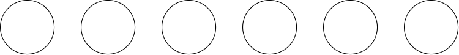
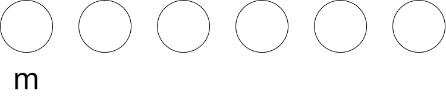
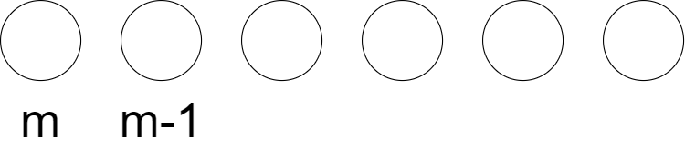
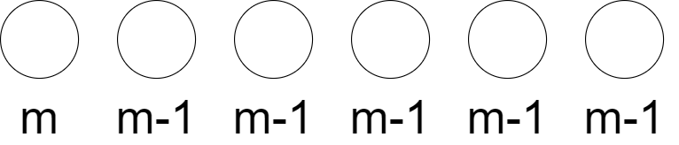
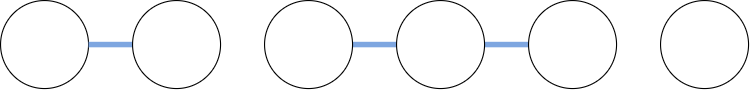
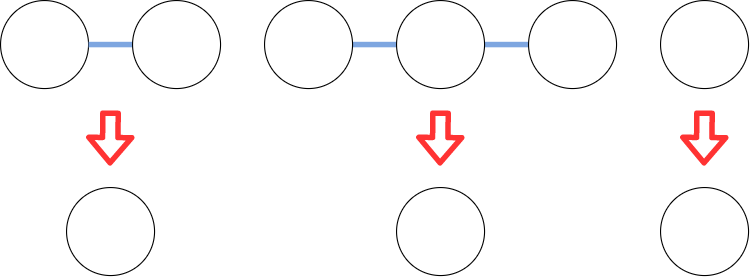
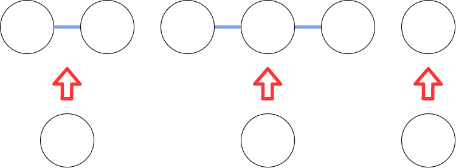
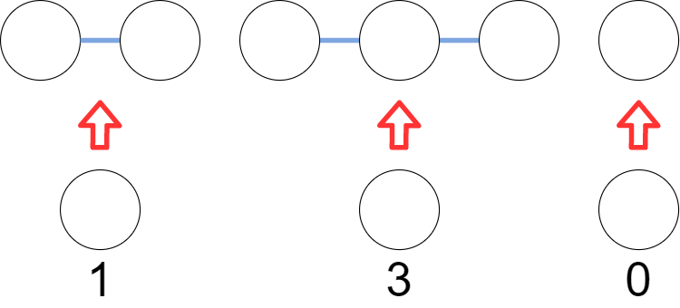
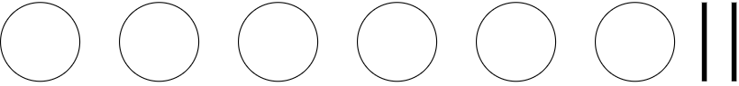

# ABC167

## A問題

[ソースコード](https://atcoder.jp/contests/abc167/submissions/13021989)

**A 入出力の受け取り**：文字Sと文字Tから末尾の文字を取り除いた物を比較します。

## B問題

[ソースコード](https://atcoder.jp/contests/abc167/submissions/13032258)

**B 入出力の受け取り**：和の最大化をするには、1が書かれたカード->0が書かれたカード->-1が書かれたカードというようにとっていけばいいです。

## C問題

[ソースコード](https://atcoder.jp/contests/abc167/submissions/13048788)

**C bit全探索**：なんかいっぱい書いてあるので難しそうですが、bit全探索すれば解けます。特に数学的性質はないので無理そうです。なので全探索をします。このとき、n(教科書の数)がせいぜい12であることに注目します。すると、各教科書に対してえらぶ、選ばないの2状態が存在し、それらを全探索するので、最低でも$$2^{12}$$となります。これは約$$10^3$$ぐらいなので十分早くできそうです。また、各教科書に関してm個のアルゴリズムの向上度がありますがこれも$$12$$なので大丈夫です。

bit全探索は検索すればたくさん出てきます。bitといっても本質は全探索です。bitの1，0をそれぞれ買う、買わないとしてとらえます。そうするとn桁bitを要してあげると効率よく全列挙することが可能です！

## D問題

[ソースコード](https://atcoder.jp/contests/abc167/submissions/13059750)

**D 思考、ダブリング**：とりあえず愚直にシミュレーションすれば行けそうですが、kが$$10^{18}$$なのであきらめます。さすがにそんなにループできません。では、考察をしていきましょう。以下に入力例1をグラフにしたものを表します。

これは実際に通ることになるループ先を示したものです。こうやってみるとループができることが分かります。なので、一度、このループに突入してしまうと一生ぐるぐるすることになります。そうするとkをうまく余りで表現してあげることで工夫できそうです。

以上の考察を簡単にまとめると

- ループを探す
- 剰余を利用してkmod(一度のループに必要な回数)をとる。

といった感じになります。ここまで来れば答えまでもう少しです。ではどの様にしてループを探しましょう。ループするということは一度着たことある場所に戻ってくるということです。なので、各町について来たことがあるかを保存する配列を用意します。では、一度着たことある場所に戻って来たとします。そこからの行動経路はループしている要素なので、ループ始まるところに戻ってくるまで移動しながらその経路を記録します。するとうまくループを検出できます。この検出方法の最悪なケースはすべての町をループしている場合でせいぜい町の個数で収まりそうです。なので、十分間に合わせることができます。

なお、この解説のようなアルゴリズムではなく、ダブリングというアルゴリズムでも解くことができるそうです。

## E問題

[ソースコード](https://atcoder.jp/contests/abc167/submissions/13127256)

**組み合わせ、重複組み合わせ**：ではまずはm色の塗分けについて考察していきましょう。話の簡単にするために、**隣り合うボールは必ず異なる色で塗られる**として考察します。ではこんな感じにn個のボールを考えます。

最初は何色で塗ってもいいのでm通り考えられます。

その次の色は最初の色以外を選択できるのでm-1通りです。

その次の色も同じようにm-1通りになります。その次も、その次の次もm-1通りです。

するとこんな感じになります。結局、隣り合うボールは必ず異なる色で塗ったときは$$m * (m-1)^{n-1}$$となります。

では、この問題の一番難しいとこにとりかかりましょう。この問題の肝になるのは、**隣り合うブロックの組であって同じ色で塗られている組は、K組以下である。**という条件です。この条件について考えていきます。

まずは図の青の棒の様に、同じ色で塗るボールの対応を考えます。

すると、上の図のようになります。この同じ色のボール群を圧縮します。

こんな感じに圧縮出来ました。こうすると始めに考察してきた**隣り合うボールは必ず異なる色で塗られる**とした場合の問題に落とし込むことができます。つまり、この**隣り合うブロックの組であって同じ色で塗られている組は、K組以下である。**の条件は、**青の棒の本数がk以下である**とも言えます。ここまで来たら、この棒の配置を考えてあげるだけです。

では棒の配置を考えましょう。その前に圧縮したものを復元するときを考えましょう。つまり、図のような対応を考えます。

この対応を考える時に、このままだと**ボール5個を3つに分ける**という問題と同じなので、複数の対応を考えることができてしまいます。

ここで、青の棒の数を記憶したまま圧縮すればどうでしょうか？

つまり、図のように圧縮します。すると、圧縮後のボール群は、圧縮前のボールの個数を覚えているので、圧縮前と圧縮後を1対1対応させることができます！(やったー！)

ここまでくればあと少しです。本題の**隣り合うブロックの組であって同じ色で塗られている組は、K組以下である。**にとりかかります。前述したとおり、この問題は、**青の棒の本数がk以下である**というように言い換えができます。なので、1対1対応させることのできる圧縮をした場合、この**数字の和がk**を示しています。

(上の図の場合、ボールを4つの隣り合うペアで塗分けた場合を示している。)

なので、この数字をうまくいじってやればいいのです。この問題は、図の場合、**ボール5個を3つに分ける分け方**に対応しているので、重複組み合わせを活用すればいいのです。

重複組み合わせと来たら、ボールと仕切りで考えます。(2)

こんな感じです。5つのボールを3つに分割するには2つの仕切りが必要です。このボールと仕切りの並び方を考えます。この並び方は$${}_{3 + 2} C_2$$となります。(※仕切りまたはボールの配置を決めてしまえば、もう片方の配置は一意に定まります。)

この重複組み合わせの考え方を一般化すると、k個のボール群があり、n-k-1個の仕切りがあるとします。すると$${}_n - 1 C_{k}$$となります。

長くなりましたが、ここまでの考察を踏まえるとこの問題の解は

$$\sum_{i=0}^k m \times (m-1)^{n - i - 1} \times {}_n - 1 C_{k}$$

となります。(1)

考察がうまくいったからといって実装ができないと話になりません。この組み合わせを愚直に実装すると必ずoverflowします。そこで、余りをとっても加減乗までは、互いに素である素数でMODをとるだけで簡単に出来ますが、徐はそうではありません。余りの逆元を考えなくてはいけません。そこでフェルマーの小定理を利用して、逆元を求め、組み合わせの数を算出します。この方法だと、overflowせず、正しく、余りの数を出すことができます。何のことかわからない人は参考にある記事を読むか、フェルマーの小定理で検索しましょう。(3)

参考：

(1)[【競プロ実況】ABC167 E問題【かつっぱ】](https://www.youtube.com/watch?v=FkiDr1yd_9c&t=0s)

(2)[重複組合せの公式と例題（玉，整数解の個数）](https://mathtrain.jp/tyohukuc)

(3)[フェルマーの小定理の証明と使い方](https://qiita.com/drken/items/6b4031ccbb2cab7436f3)

