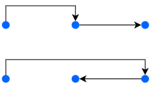
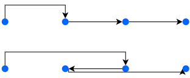

# ARC067

## E問題

[ソースコード](https://atcoder.jp/contests/arc067/submissions/12690671)

**D 全探索**：全探索といっても、そこまで全探索でもない。それでは以下のように考えてみる。まずは3地点を例にして考察する。以下のように3地点存在しているとする。

次にワープすることを考えてみる。次のような例が挙げられる。

個の2通りのコストは同じである。ワープするコストは距離に依存しないので、この2通りは同じコストになる。

では次は4つにして考察をしてみる。

少し見ずらいが、下の経路は3番目にワープし、2番目まで徒歩、4番目まで徒歩となっている。

こうすると、一度徒歩で戻るという行為は無駄であることが分かる。なので、常に右へ行くことを考える。よって、この問題は今いる地点とその次の地点にのみ注目すればいい

答えは隣接した2点間で$$min(A \times |X_i - X_{i+1}|, B)$$を計算し、その和とればよい。(1)

参考：

(1) [公式解説pdf](https://img.atcoder.jp/arc067/editorial.pdf)