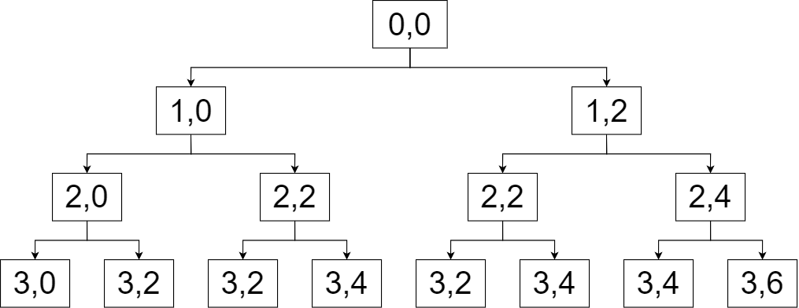
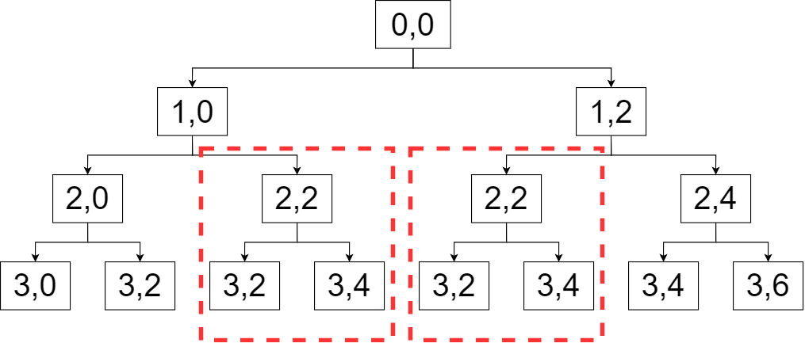

# ナップサック問題

## 個数制限ありナップサック問題

### ナップサック問題とは

ナップサック問題とは、「$$n$$個の品物があり、i番目の品物は$$weight_i =$$重さ、$$value_i =$$価値となっているとき、重さの総和が$$W$$を超えないように選んだ時の価値の総和の最大値を求めよ。」というものである。

愚直に全探索をしようとすると、品物一つ一つに いれる、いれない の2状態があり、その状態を決めた後、重さの総和がW以下のときの価値の最大を求めることになるので$$O(2^n)$$となる。この計算量では、時間がかかり過ぎてしまう。この問題を効率よく計算するためにDP(動的計画法)を使う。

### 考え方

考え方としては、無駄な部分を省く である。そのためにはどこが無駄な部分であるかを考えてみよう。

例として次のような問題を考えてみる。

3個の品物があり、それぞれの品物は(weight,value) = (1,2),(2,3),(2,4)と表される。このとき、重さ6以下になるように品物を選んだ時、価値の総和はいくつになるか。

この問題を全探索したときの図を書いてみる。図は以下のように書く。


このノードは、<u>i番目までの品物で重さjの時の価値の総和の最大値</u>を表している。このノードを使って全探索の様子を図にすると以下のようになる。



全探索をした場合、以上のようになり、この図からも、先ほど述べたように計算量が$$O(2^n)$$になってしまうことが分かる。この図の中で無駄な計算をしているのはどこだろうか。



この上の図の赤い点線で囲われた範囲が無駄な場所である。つまり、全く同じこと2回繰り返しているのである。この部分をdp(動的計画法)を使って最適なものにする。

### 実装

では上の考え方を受けて実装してみよう。今回のdpテーブルは以下のようになる。

dp[i][j] := i番目までの品物で重さjの時の価値の総和の最大値

このdpを利用して実装すると以下のようになる

```cpp
#include <iostream>
using namespace std;

int main()
{
    int n, w;
    //入力の受け取り
    cin >> n >> w;
    //配列の宣言
    int dp[n + 1][w + 1], w[n], v[n];
    
    //入力の受け取り
    for (int i = 0; i < n; i++)
    {
        cin >> w[i] >> v[i];
    }

    //dpテーブルを0で初期化
    for (int i = 0; i <= n; i++)
    {
        for (int j = 0; j <= w; j++)
        {
            dp[i][j] = 0;
        }
    }

    for (int i = 0; i < n; i++)
    {
        for (int j = 0; j <= w; j++)
        {
            if (j < w[i])//i番目の品物が入らないとき
            {
                dp[i + 1][j] = dp[i][j];
            }
            else
            {
                //i番目をいれないかつ重さがjだった時の価値の総和とi番目をいれて重さjになったときの価値の総和を比べて大きい方を代入。
                dp[i + 1][j] = max(dp[i][j], dp[i][j - w[i]] + v[i]);
            }
        }
    }
    cout << dp[n][w] << endl;
    return 0;
}
```

コードの説明はコード中のコメントを参考にしてほしい。こうすると計算量は$$O(nW)$$まで減らすことができる。元々$$O(2^n)$$だったものをここまで減らすことができた。
※いまいちわからない人は、全探索の時に書いた図のはじめて訪れる地点の数を数えると、すこし分かると思う。

## 個数制限なしナップサック問題

### 個数制限なしナップサック問題とは

いままでナップサック問題について考察してきた。では次のような問題の時どうなるだろうか。

「$$n$$種類の品物があり、i番目の品物は$$weight_i =$$重さ、$$value_i =$$価値となっているとき、重さの総和が$$W$$を超えないように選んだ時の価値の総和の最大値を求めよ。」

この問題では個数制限がなくなり好きなものを好きなだけ選べるようになっている。ここで上に述べたようにdpを実装すると最悪の場合$$O(nW^2)$$となってしまう。つまりは個数制限がなくなったので、もしも入力に重さ1の品物があったときはその品物を1~W個までの状態を探索しなくてはならない。

### 考え方

少し考え方を変えるとこの問題の計算量を減らすことが可能である。まずは個数制限がある状態のナップサック問題をそのまま応用したときに現れる無駄なものとはどんなものだろうか？

以下にそれを実装したソースコードを示す。

```cpp
    for (int i = 0; i < n; i++)
    {
        for (int j = 0; j <= w; j++)
        {
            for(int k = 0; k * w[i] <= j; k++){
                dp[i + 1][j] = max(dp[i][j], dp[i][j - k * w[i]] + k * v[i]);
            }
        }
    }
```

今回は入出力の部分が同じなので省いた。

このようになっている。このkに関するループが問題である。このkのループでは各商品をk個選んだ時を表している。このkのループをどうにかできないかを考えてみよう。

i番目の商品をk個選ぶときというのは、i番目の商品をk-1個選んだときにもう一つ選んだとも言える。つまり、わざわざkごとについて検証する必要はなく、k-1個を利用してkを検証してしまおうという考え方である。

### 実装

それでは前回と同じような想定で実装すると以下のようになる。

```cpp
#include <iostream>
using namespace std;

int main()
{
    int n, w;
    //入力の受け取り
    cin >> n >> w;
    //配列の宣言
    int dp[n + 1][w + 1], w[n], v[n];

    //入力の受け取り
    for (int i = 0; i < n; i++)
    {
        cin >> w[i] >> v[i];
    }

    //dpテーブルを0で初期化
    for (int i = 0; i <= n; i++)
    {
        for (int j = 0; j <= w; j++)
        {
            dp[i][j] = 0;
        }
    }

    for (int i = 0; i < n; i++)
    {
        for (int j = 0; j <= w; j++)
        {
            if (j < w[i]) //i番目の品物が入らないとき
            {
                dp[i + 1][j] = dp[i][j];
            }
            else
            {
                //i番目をいれなかったときの総和とk個いれたときの総和を比較し、大きい方を代入。
                dp[i + 1][j] = max(dp[i][j], dp[i + 1][j - w[i]] + v[i]);
            }
        }
    }
    return 0;
}
```

同じようにソースコード中のコメントを参考にしてほしい。このようにすると最悪$$O(nW^2)$$だったものが$$O(nW)$$で計算できるようになる。
※計算量のニュアンス的には$$n^3$$が$$n^2$$になった感じ。

## 一次元での実装

### 一次元での実装とは

これらの実装は一次元でも実装可能で計算量だけでなくメモリの消費も抑えることができる。しかし、デバックがしにくくなる、読みずらいなどの問題もあるので、メモリ制限にかかりそう、もっと簡潔に書きたいという以外ではあまり意味ない。

### 考え方

今回のナップサック問題ではiをi番目の商品をという意味で使用し、その分の配列も用意したが実際にはそこまで重要じゃない。つまり重さの情報のみでやりくりする。
※個数制限ありのナップサック問題で、iの配列の必要性を簡単に確認してみると、実際の比較にはi列目のjの重さj-w[i]の重さとしか比較してないので必要ない。

### 実装

個数制限あるナップサック問題

```cpp
for (int i = 0; i < n; i++)
{
    for (int j = W; j >= w[i]; j--)
    { //i番目をいれないかつ重さがjだった時の価値の総和と、i番目をいれて重さjになったときの価値の総和を比べて大きい方を代入。
        dp[j] = max(dp[j], dp[i][j - w[i]] + v[i]);
    }
}
```

個数制限のないナップサック問題

```cpp
for (int i = 0; i < n; i++)
{
    for (int j = w[i]; j <= W; j--)
    { //i番目をいれないかつ重さがjだった時の価値の総和と、i番目をいれて重さjになったときの価値の総和を比べて大きい方を代入。
        dp[j] = max(dp[j], dp[i][j - w[i]] + v[i]);
    }
}
```

こんな感じになる。こう見ると個数制限のあるなしはループの順番の違いでしかないことが分かって面白い。

参考：

1)プログラミングコンテストチャレンジブック　第2版　p52~p60

2)[典型的な DP (動的計画法) のパターンを整理 Part 1 ～ ナップサック DP 編 ～](https://qiita.com/drken/items/a5e6fe22863b7992efdb)　１ナップサックDPとは、２ナップサック問題